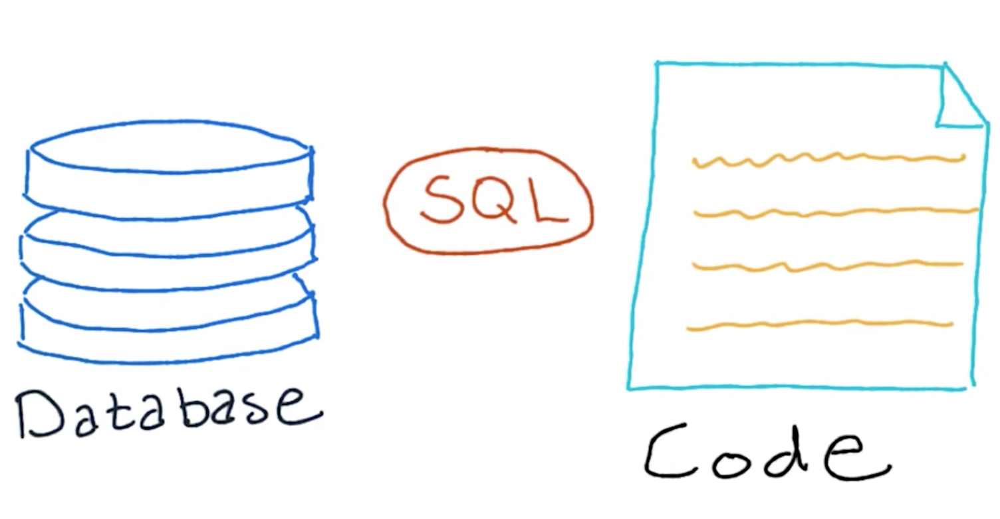
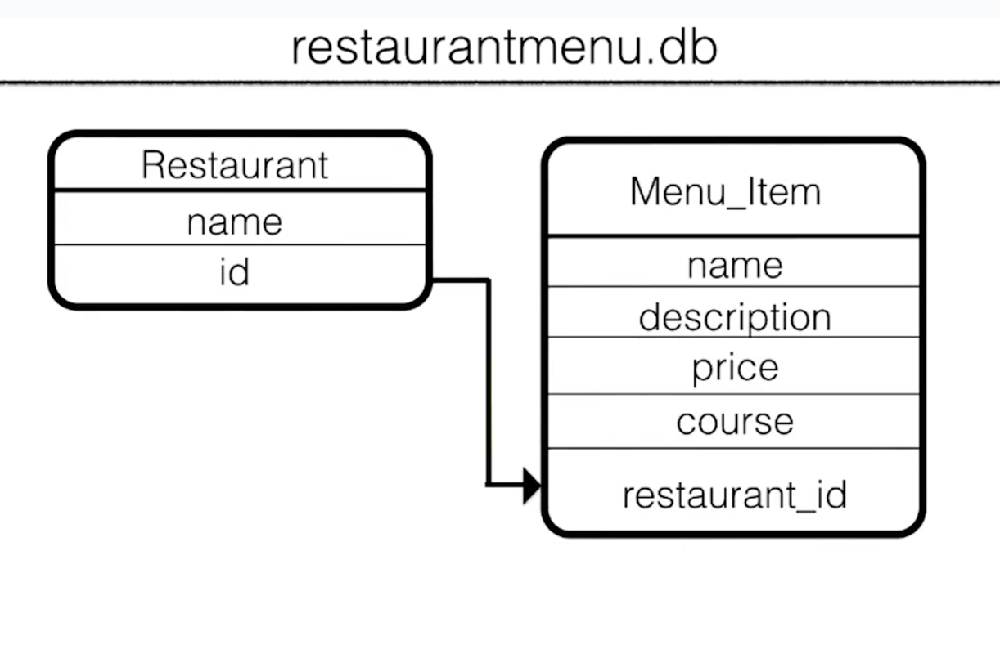
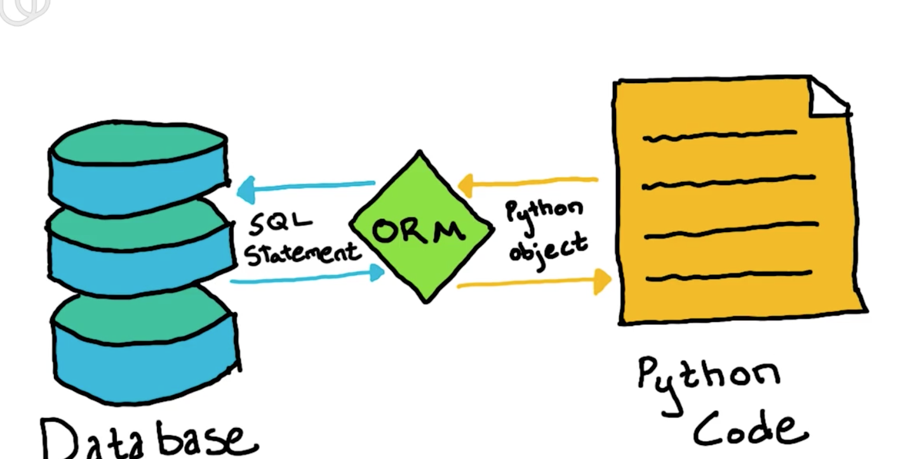
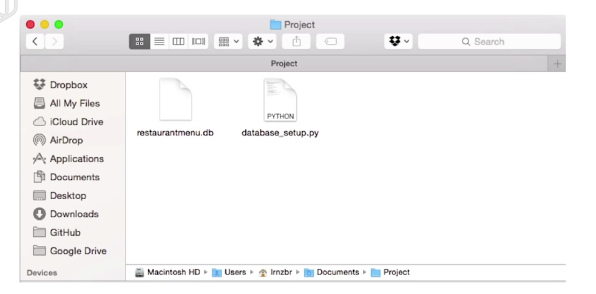

## SQL

### SQL 语句

我们知道网站是通过数据库来进行 CRUD 操作的，但是怎么样可以让这两者联系起来呢？SQL 就是当下用来操作数据库最流行的语言。通过以下一些简短的例子，我们可以快速的将 SQL 语句和 CRUD 操作对应起来：



```
# INSERT INTO => create
# SELECT => read
# UPDATE => update
# DELETE => delete
```

### 创建数据库

我们这次的 CRUD 应用是做餐馆管理应用，所以我们的数据库会包括两个东西，餐馆和菜单，大概如下：



好，有了这个结构，我们就可以开始写代码了。

``` python
import sqlite3
conn = sqlite3.connect('restaurant.db')

c = conn.cursor()
c.execute('''
    CREATE TABLE restaurant
    (id INTEGER PRIMARY KEY ASC, name VARCHAR(250) NOT NULL)
    ''')

c.execute('''
    CREATE TABLE menu_item
    (id INTEGER PRIMARY KEY ASC, name VARCHAR(250), price VARCHAR(250),
    description VARCHAR(250) NOT NULL, restaurant_id INTEGER NOT NULL,
    FOREIGN KEY (restaurant_id) REFERENCE restaurant(id))
    ''')

conn.commit()
conn.close()
```

通过 SQL 语句我们可以完成创建两张表的工作，但是，对于 Python 来说，这只是一些语句而已。意味着当出现错别字，或者引用了一张完全不存在的表的时候， Python 并不能发挥作用。

在 Pyhon 里面，一切皆为对象，那么为什么不把数据库查询，列表都当作是对象呢？于是 ORM 就出现了！

### ORM

ORM(Object-Relational Mapping)，即对象关系映射，简单的说就是对象模型和关系模型的一种映射。



### SQLalchemy

在 python 里面，最为流行的 ORM 选择就是 [SQLalchemy](http://www.sqlalchemy.org/)，如果你用了 Vagrantfile 的话，SQLalchemy 已经安装在上面了，如果你不打算用虚拟机开发的话。请在官网上面自行下载。

#### 通过 SQLalchemy 创建数据库表格

首先我们需要创建一个 python 文件，名字叫做 database_setup.py。通常来讲，对于 SQLalchemy，创建数据库表格会有四部分组成，包括：

- 配置
    - 用于引入所需要的模块（在文件的开始）
    - 连接数据库并且导入数据（在文件的最后）
- 类名
    - 用 python 的类来表示一张表
    - 拓展 base 类
- 表
    - 指定特定的表
- 映射

##### 配置

``` python
import os
import sys
from sqlalchemy import Column, ForeignKey, Integer, String
from sqlalchemy.ext.declarative import declarative_base
from sqlalchemy.orm import relationship
from sqlalchemy import create_engine

Base = declarative_base()

# at the end of the file
engine = create_engine('sqlite:///restaurantmenu.db')

Base.metadata.create_all(engine)
```

在上面的配置中，我们需要引进不同的模块，这里会做简要的介绍，通过 `os` 和 `sys` 模块，允许我们在不同的操作环境运行而不受干扰，同时也可以执行一些与命令行有关的交互。从 `sqlalchemy` 中我们需要引进一些常用操作数据库的方法，例如列表，整数类型，字符串类型，外键。而在  `sqlalchemy.ext.declarative` 模块中导入最基本的类，python 下的数据对象将会基于这个类扩展。通过 `sqlalchemy.orm` 我们可以引进关系类型结合外键构造两个表之间的联系。最后通过 `create_engine` 类，我们可以连接到所需要的数据库。通过 `Base` 我们可以让 SQLalchemy 知道 Base 是一个特殊的与 SQLalchemy 有映射的类。

在下面两句话中，我们分别创建了与数据库的联系和在数据库中创建相对应的表并更新信息。

##### 类名，表，映射

``` python

class Restaurant(Base):
    __tablename__ = 'restaurant'

    # mapper code here
    id = Column(Integer, primary_key=True)
    name = Column(String(250), nullable=False)

class MenuItem(Base):
    __tablename__ = 'menu_item'

    # mapper code here
    name = Column(String(80), nullable=False)
    id = Column(Integer, primary_key=True)
    description = Column(String(250))
    price = Column(String(8))
    course = Column(String(250))
    restaurant_id = Column(Integer, ForeignKey('restaurant.id'))
    restaurant = relationship(Restaurant)

```

在上面的代码中，我们继承了 Base 类并对其进行了扩展，通过 `__tablename__` 来指定我们要创建的表格，通过一些属性来进行映射。达到创建表和设置属性的目的。

好了，这个时候，我们的目录是这样的：



接下来只要将上面的代码放在一起，其中restaurant.db是一个空文件，到你的目录下运行`python database_setup.py`，你就成功在restaurant.db 里创建了两个表了。

## SQLalchemy 进行 CRUD 操作

### Create

首先打开虚拟机，通过 ssh 连接，并 cd 到 /vagrant，建立一个 python 文件进行下列操作

``` python
from sqlalchemy import create_engine
from sqlalchemy.orm import sessionmaker
from database_setup import Base, Restaurant, MenuItem

engine = create_engine('sqlite:///restaurantmenu.db')
Base.metadata.bind = engine

DBSession = sessionmaker(bind = engine)
session = DBSession()
```

首先导入我们所需要的模块，通过 `create_engine` 告知文件我们需要连接的是哪一个数据库，然后将 `engine` 与 `Base.metadata.bind` 进行绑定，以确定我们连接的类和数据绑定在一起了。

接下来我们需要一个 `session` 对象，可以帮助代码执行 CRUD 动作和 `engine` 结合起来。在 SQLalchemy 里面我们可以通过 `session` 对象来执行 CRUD操作，类似于 git，它会讲这些操作放进暂存区，但是不会立刻执行直到使用了 `commit` 方法。同时意味这你也可以用 `rollback` 方法回滚到上一次提交。接下来我们将进行 create 的操作。

``` python
myFirstRestaurant = Restaurant(name='Pizza Hut')
session.add(myFirstRestaurant)
session.commit()
```

我们的第一个餐馆就已经成功建立并提交到数据库了！

### Read

在 code 文件夹中找到 lotsofmenus.py 并在终端运行它，添加完毕以后，会输出 “added menu items!” ，这个时候创建另外一个文件，保存为 py 形式。同样导入上述代码：

``` python
from sqlalchemy import create_engine
from sqlalchemy.orm import sessionmaker
from database_setup import Base, Restaurant, MenuItem

engine = create_engine('sqlite:///restaurantmenu.db')
Base.metadata.bind = engine

DBSession = sessionmaker(bind = engine)
session = DBSession()
```

这个时候我们就可以开始数据库操作了，假如我们要查询所有的餐馆并打印出对应的属性，可以用下面的代码：

```python
restaurants = session.query(Restaurant).all()

for restaurant in restaurants:
    print restaurant.name
```

通过 `query` 方法，我们就可以完成查询一个列表的功能了，假如我们需要对其中一些属性进行筛选，可以用 `filter_by` 这个方法，更多的方法，大家可以到 [SQLalchemy](http://www.sqlalchemy.org/) 上面查阅。

### Update

我们需要更新某个数据，这个时候通过查询对应的数据，并直接通过赋值更改之前的属性，然后再保存即可完成数据的更改了，十分简单：

``` python
# 导入数据库模块部分略，参考上面的代码
engine = create_engine('sqlite:///restaurantmenu.db')
Base.metadata.bind = engine

DBSession = sessionmaker(bind = engine)
session = DBSession()

editRestaurant = session.query(Restaurant).filter_by(id=1).one()
editRestaurant.name = updateRestaurant
session.add(editRestaurant)
session.commit()
```

### Delete

至于删除则更为简单了，只需要把查询出来的，用 `delete` 方法就可以了。例如我们想删除编号为 100 的餐馆：

``` python

deleteRestaurant = session.query(Restaurant).filter_by(id=100).one()
session.delete(deleteRestaurant)
session.commit

```


## CRUD 测验题

请完成空白的部分：


