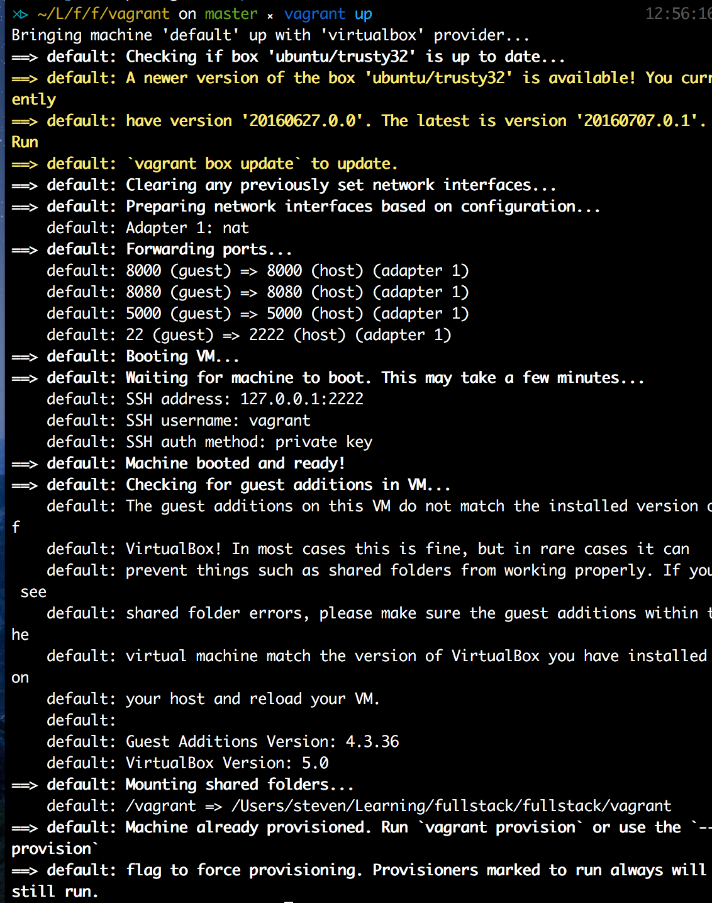
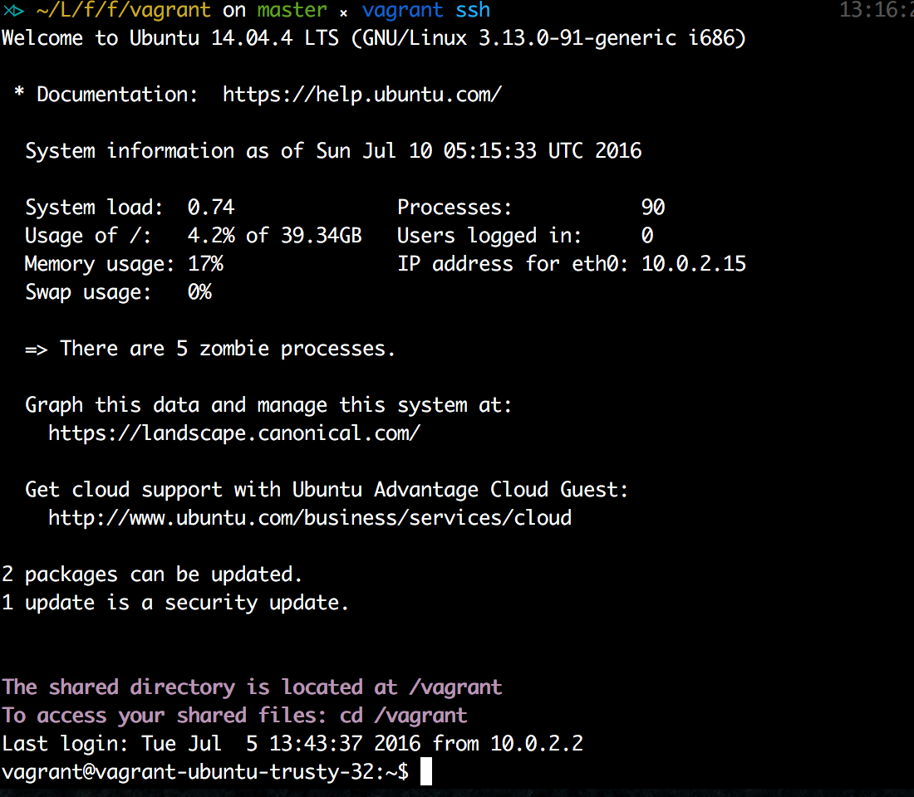

# 开发环境准备

在开始任何一个新技术之前，我们都需要准备相对应的开发环境。例如，前端环境需要有浏览器，文本编辑器，甚至 node 环境。而同样在开始我们的项目之前，我们也需要搭建开发环境。

有时候我们搭建环境总会遇到各种各样的问题，因为环境搭配不一致，导致我们在学习的时候常常需要花上很多时间纠结在环境配置不同的坑上，甚至丧失学习这个技术的兴趣。而同样在开发项目的时候，因为团队搭建环境不一致而导致的进度问题也是显而易见的。因此，我们需要有一个可以帮助我们统一搭建环境的东西。

## Vagrant

[Vagrant](https://github.com/mitchellh/vagrant) 很好的解决了上述的问题，通过配置一个虚拟机镜像，保证了大家开发环境的一致性。而通过 Vagrant，我们可以在本机的系统上通过终端与虚拟机进行交互，而且还可以共享文件，意味着你仍然可以在你自己的系统上用你最喜欢的编辑器编写的你代码，而无需去纠结装什么版本，修改什么配置才能搭建好环境。

在 [Go-in-Action](https://github.com/astaxie/Go-in-Action/blob/master/ebook/zh/01.0.md) 里面，提到了很多 Vagrant 的好处和用法，这里不再赘述。我们直接进入正题。

### 安装配置

实际上Vagrant只是一个让你可以方便设置你想要的虚拟机的便携式工具，它底层支持VirtualBox、VMware甚至AWS作为虚拟机系统，本书中我们将使用VirtualBox来进行说明，所以第一步需要先安裝Vagrant和VirtualBox。

#### VirtualBox 安装
https://www.virtualbox.org/wiki/Downloads/

#### Vagrant 安装
http://www.vagrantup.com/downloads.html
> 要想检测安装是否成功，可以打开终端命令行工具，输入vagrant，看看程序是不是已经可以运行了。如果不行，请检查一下$PATH里面是否包含vagrant所在的路径。

#### Vagrant 配置
- 下载 BOX

    首先在将此仓库的 vagrant 文件夹中的两个文件复制保存在你本地需要开发的文件夹中。cd 到你的目录，执行下面的语句

    ```
    vagrant up
    ```

    这时 vagrant 就会自动帮你下载所需要的系统包和预安装所需要的包，例如这里我们将会用到的 SQLalchemy 和 Flask 等等。同时 Vagrantfile 也帮我们配置好了，虚拟机对应的端口映射到我们主机上的端口，例如

    ```
    config.vm.network "forwarded_port", guest: 8000, host: 8000
    ```

    在服务器运行后，制定 8000 端口，我们就可以在主机上对应的 8000 端口访问虚拟机搭建的服务器了。

    

    由于众所周知的原因，当你下载速度太慢的时候，可以直接用我已经打包好的 box，直接在本地 add 上去就可以了。地址：[百度云](https://pan.baidu.com/s/1jIbcgMq)

- 进入 BOX

    ```
    cd path/to/dev/vagrant

    vagrant ssh
    ```

    出现如下图所示的画面，你就成功进入了我们的开发环境了！
    

    在此目录下用语句

    ```
    vagrant halt
    ```

    即可退出当前虚拟机环境


---

现在我们的 vagrant 之旅会告一段落，我们现在会开始创建第一个 CRUD 应用了！

[下一章节：第一个 CRUD 应用](chapter_1_1.md)
